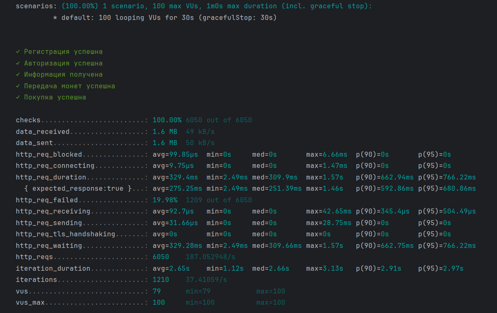

# merch-store

## Описание задачи

Необходимо реализовать сервис,
который позволит сотрудникам обмениваться монетками и приобретать на них мерч.
Каждый сотрудник должен иметь возможность видеть:

Список купленных им мерчовых товаров 
Сгруппированную информацию о перемещении монеток в его кошельке, включая:
Кто ему передавал монетки и в каком количестве
Кому сотрудник передавал монетки и в каком количестве

Количество монеток не может быть отрицательным,
запрещено уходить в минус при операциях с монетками.

## Свои дополнения

1) Для хранения информации о мерче использовалась мапа, 
которая находится в _item_service.go_. Как я понимаю,
это должно работать быстрее по сравнению с PostgreSQL и NoSQL решениями.
2) В предложенном API отсутствовала обработка ошибок 404 
(Может возникнуть, если мы переводим монеты несуществующему пользователю),
409 (может возникнуть, когда мы регистрируем аккаунт с ником, который уже используется).
Также 400 ошибка - это не всегда неверный запрос (если монет на счету для проведения операции недостаточно - это тоже 400 ошибка).
В своем решении я учел эти нюансы.
3) Не совсем понял, как именно Вы хотели чтобы выглядела аунтификация, поэтому разбил её на авторизацию и регистрацию.
4) Было проведено тестирование. Unit-тесты были написаны почти на все функции (В некоторых случаях использовались моки).
Для интеграционных тестов была развернута еще одна БД (они находятся в tests/api_test.go). Помимо этого было проведено нагрузочное тестирование с помощью инструмента k6 (tests/load_testing.go).
5) В .golangci.yaml описана конфигурация линтера.
6) Приложение может работать как локально, так и в контейнерах. 
Тестовая БД закомментирована, так как при запуске сервера, происходит конфликт.
То есть тесты запускать при выключенном сервере и с тестовой БД.

**Результаты нагрузочного тестирования**


## Запуск

Склонируйте репозиторий, а затем
```
docker compose build
docker compose up
```
Проверял через Postman. Вот примеры эндпоинтов:

```
Регистрация:
http://localhost:8080/api/register
В теле запроса:
{
    "username": "admin",
    "password": "123"
}

Авторизация:
http://localhost:8080/api/auth
В теле запроса:
{
    "username": "admin",
    "password": "123"
}

Получение информации о пользователе:
http://localhost:8080/api/info
Нужен jwt-токен

Покупка мерча:
http://localhost:8080/api/buy/cup
Нужен jwt-токен
В теле запроса:
{
    "amount": 7
}

Перевод монет:
http://localhost:8080/api/sendCoin
Нужен jwt-токен
В теле запроса:
{
    "toUser": "user2",
    "amount": 34
}
```

